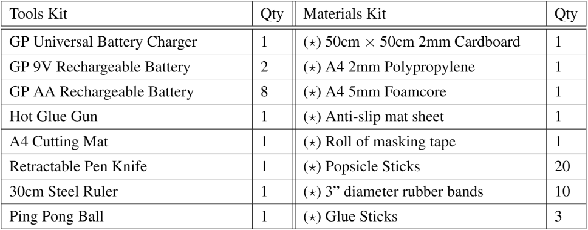

# EG1311

## Course Material
- [Course Information](CourseMaterials/Course_Information.pdf)
- [Project Materials](CourseMaterials/Project_Materials.pdf)
- [Template Project Instructions](CourseMaterials/Template_Instructions.pdf)

## Project

Able to print one 20cm by 20cm 3mm thick Black Acrylic per Tutorial in addition to the following.

The source code is in the [src](src/) directory.

## Arduino
- [Syntax Reference](https://www.arduino.cc/reference/en/)
- [Libraries](https://www.arduino.cc/reference/en/libraries/)
- [Servo Library](https://www.arduino.cc/reference/en/libraries/servo/)

